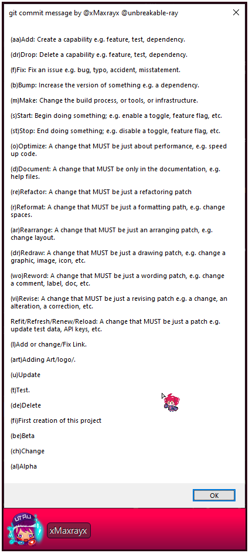

# git commit message.

Small AHK script to write git commit message faster with just 1-2 keys for one word.

   

## How to use it:

- Open GitHub Desktop.

- Run the script (it will only works for `GitHubDesktop.exe`).

- Press `F1` to know the key combinations / Shortcuts.

  it will appear like this :

        

##### Note :

You don't need to close the script because it will only work for GitHub so it's better to leave it on the background to save your time